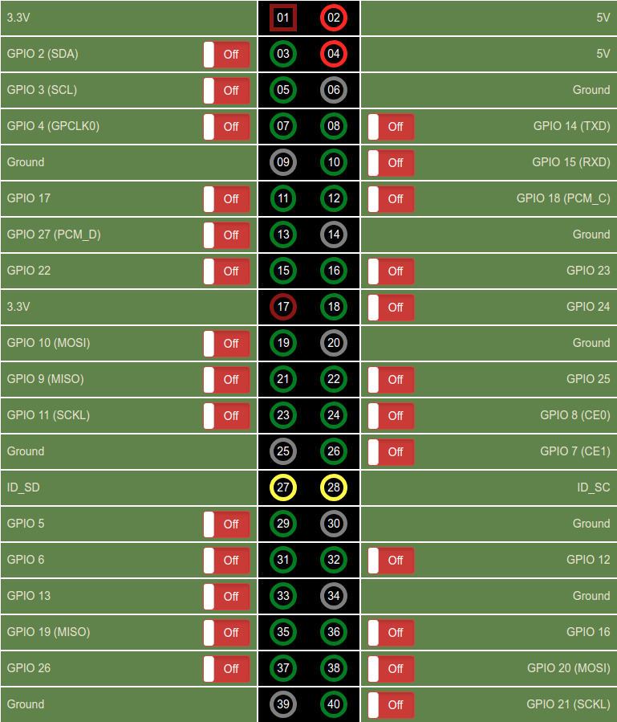

# Raspberry-Pi-Simple-Web-GPIO-GUI
Simple Node.JS Webserver for controlling GPIOs of the Raspberry Pi

Tutorial (english): https://tutorials-raspberrypi.com/setup-raspberry-pi-node-js-webserver-control-gpios/

Tutorial (german): http://tutorials-raspberrypi.de/raspberry-pi-nodejs-webserver-installieren-gpios-steuern

## Settings

The following environment variables are supported:

 - `PORT` - The port the webserver runs at. (default 80)

***The [dotenv](https://github.com/motdotla/dotenv) environment is supported.***